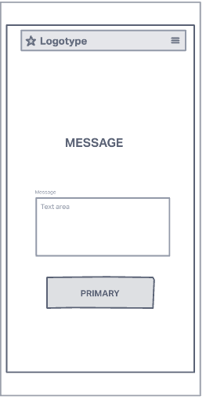
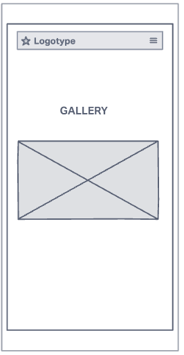
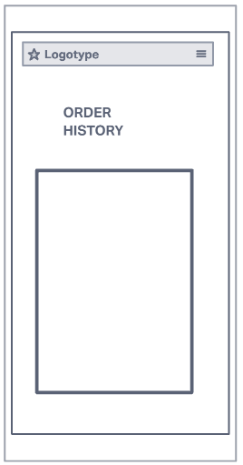

# Myrag

## Introduction
Myrag is a custom headwrap/durag website. The name plays on the item of focus - durag, and aims to help the end user feel a personal connection to the item. 

## UX

### Strategy

### Methodology - Agile

I decided to take an agile approach for the construction of my site. I made use of the projects section on GitHub, to impliments a MoSCoW prioritization technique.
I molded a user story template and used this to create, and organise my user stories into 3 seperate lists. Lists which defined where each user story was, in terms of progress.
To-do, in progress and done, all adequately named for the goal at hand.

### Site Owner Goal
Make a profit through the sale of headwraps using this website and to build a community of users.

### External User Goal
Find out more information about these custom headwraps and make an informed purchase.

### User Stories

### View & Navigation

### Registration & User Accounts

### Customisation

### Purchasing & Ceckout

### Entity Relationship Diagram
ss

### Wireframes

#### Main Page

#### Colour Customisation

#### Material Customisation

#### Custom Message

 
#### Gallery

 
#### FAQ & Delivery

 
#### Register

 
#### Sign in

 
#### Profile Information & Card Details

 
#### Order History

 
#### Customer Reviews

 
#### Order List

 
#### Upload to gallery

## Design

### Color Scheme

ss color pallet

I wanted the background to have dark but positive colours. I explored this by using lighter and darker blues throughout the website. This was to give the product images the ambience needed to thrive and take center stage.

### Font Choice

I went on google fonts and browsed through a selection of fonts. I used a variety of sample text to have visual comparison and settled on what I found to be a sleek font for the headings of my webpages and a tidy font for the data.

ss

### CRUD Functionality

#### Admin 
- The admin users of myrag have the ability to delete products.
ss
- The admin users of myrag have the ability to create products.
ss
- The admin users of myrag have the ability to update products.
ss
- The admin users of myrag have the ability to delete users.
ss

#### User
- The user has the ability to edit the amount of items in their basket.
ss
- The user has the ability to delete and item from their basket.
ss
- The user has the ability to add an item to their basket.
ss

### SEO & Marketing

#### FB Mockup

#### Sitemap & Robots

 

## Features 

### Acces to Site

#### Login Page

#### Registration Page

### Main Page

#### Gallery of Menu

### Shop Now Call To Action Button

### Product

#### Product Selection
 

#### Product Details
 

### Review

#### Show Review
 

#### Add Review
 

### Basket

### Add to Basket

### Show Basket

#### Update Basket Qauntity

### Checkout

### Checkout Page

### Update Checkout Items

#### Checkout Confirmation

### Profile

#### Default Delivery Information

#### Order History

### Future Features

## Technologies Used

- Git used for version control.
- HTML / CSS3 / [Bootstrap v4.6](https://getbootstrap.com/docs/4.6/getting-started/introduction/) were used for the structure and overall look and feel of the website.
- [Python] was used for the navigation and maneuverability of the site.
- [Django](https://www.djangoproject.com/) was used as the framework.
- [GitHub](https://github.com/) was used for securely storing code.
- [Gitpod](https://gitpod.io/) is the cloud based IDE.
- Python3 is used for the main code logic.
- PostgreSQL is used for storing data.
- [Heroku](https://heroku.com/) was used for live deployment.
- [ShareX](https://getsharex.com/) for capturing screenshots.
- [Font Awesome](https://fontawesome.com/) was used for the icons seen around the website.
- [Google Fonts](https://fonts.google.com/) was used to select fonts for the website.
- [Coolers](https://coolors.co/) was used as inspiration when selecting color combinations for the website.
- [Draw.io](https://app.diagrams.net/) was used to construct my erd.

## Testing

To view all testing documentation please refer to [TESTING.md](TESTING.md)

## Deployment

### Cloudinary

### Stripe 

### Heroku
The site was deployed using [Heroku](https://heroku.com/). The app can be found using this link - [Myrag](https://myrag.herokuapp.com/).

The steps are as follows:

- Log-in or Sign-up to Heroku.
- From the Dashboard click "New" then "Create New App".
- Enter a project name (unique), select a region then press "Create app".
- This will create an app and open the deploy tab. From here select the "Settings" tab.
- Set your Environment Variables by navigating to Reveal Config Vars. (mention which config vars just the keys no values and env files)
Scroll up and head to the "Deploy" section to choose deployment method. Select "GitHub" and in the "connect to GitHub" section link your GitHub account.
- Scroll down to the manual deploy option and select "Deploy Branch".
- The app will now be built. Once completed a 'Your App Was Successfully Deployed' message and a link will appear.

### Local Deployment

To make a local copy of this project, you can clone it by typing the following in your IDE terminal:

- `git clone https://github.com/devisis/myrag.git`

Alternatively, if using Gitpod, you can click below to create your own workspace using this repository.

Once your project is ready for coding, you must download the required dependencies from the requirements.txt file. You can type:

- `pip3 install -r requirements.txt`

Please note, for this particular project, there aren't any required dependencies, however, the file is still necessary in order to get the application running on Heroku.
Additionally, Heroku will require a `Procfile`, so you can type:

- `echo web: node index.js > Procfile`

## Credits
links - inspiration - 

## Acknowledgements

- Thank you to my mentor for help and support.

